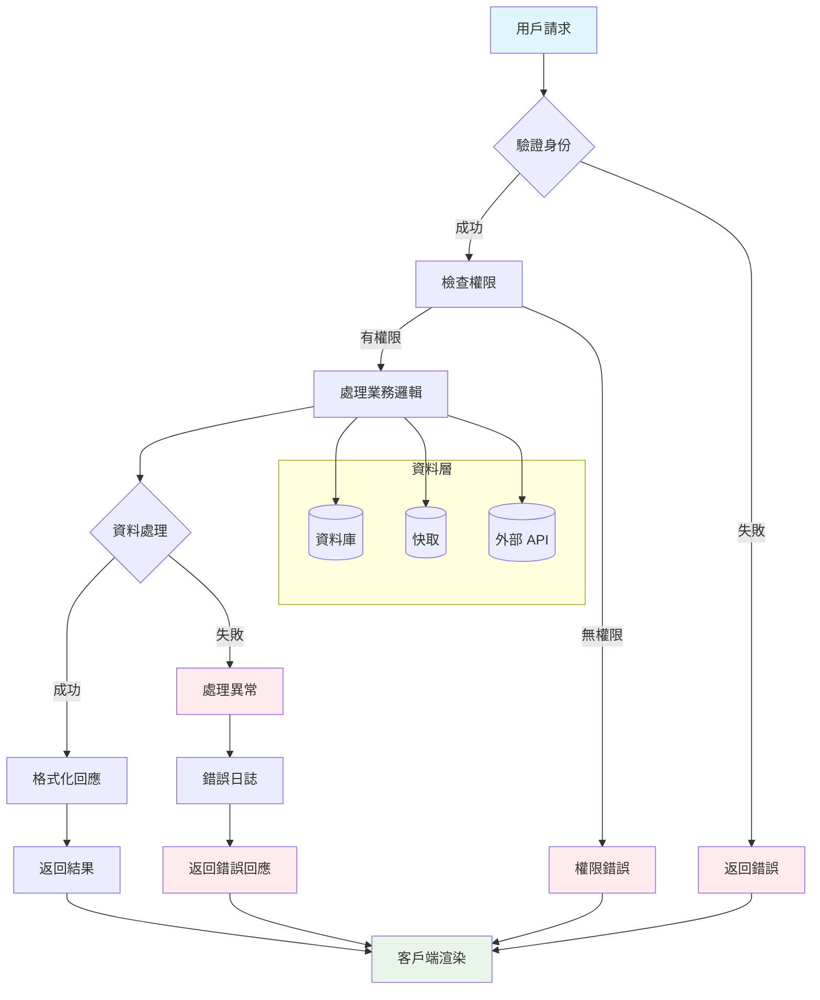
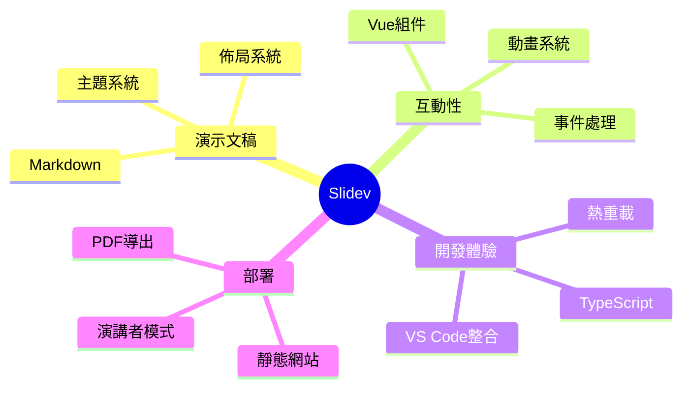

# Slidev 進階功能完全指南

## 探索 Slidev 的所有高級特性

<div class="text-lg opacity-75 mb-8">
從基礎到專家級功能的完整演示
</div>

<div class="flex gap-4 justify-center">
  <div v-click="1" class="bg-blue-500 px-4 py-2 rounded text-white">🚀 高性能</div>
  <div v-click="2" class="bg-green-500 px-4 py-2 rounded text-white">🎨 可定制</div>
  <div v-click="3" class="bg-purple-500 px-4 py-2 rounded text-white">⚡ 互動式</div>
</div>

<div class="pt-12">
  <span @click="$slidev.nav.next" class="px-2 py-1 rounded cursor-pointer" hover="bg-white bg-opacity-10">
    開始探索 <carbon:arrow-right class="inline"/>
  </span>
</div>

---

# 功能導覽

<Toc maxDepth="2" listClass="text-lg" />

---

# 高級動畫系統

使用 @vueuse/motion 創建複雜動畫

<div class="grid grid-cols-3 gap-4 mt-8">
  <div
    v-motion
    :initial="{ y: -100, opacity: 0, rotate: -90 }"
    :enter="{ y: 0, opacity: 1, rotate: 0, transition: { duration: 800, type: 'spring' } }"
    :leave="{ y: 100, opacity: 0, rotate: 90 }"
    class="bg-red-500 text-white p-6 rounded-lg text-center font-bold"
  >
    彈跳動畫
  </div>

  <div
    v-motion
    :initial="{ scale: 0, opacity: 0 }"
    :enter="{ scale: 1, opacity: 1, transition: { duration: 600, delay: 300 } }"
    :leave="{ scale: 0, opacity: 0 }"
    class="bg-green-500 text-white p-6 rounded-lg text-center font-bold"
  >
    縮放動畫
  </div>

  <div
    v-motion
    :initial="{ x: 200, opacity: 0 }"
    :enter="{ x: 0, opacity: 1, transition: { duration: 500, delay: 600 } }"
    :leave="{ x: -200, opacity: 0 }"
    class="bg-blue-500 text-white p-6 rounded-lg text-center font-bold"
  >
    滑動動畫
  </div>
</div>

<div v-motion
  :initial="{ y: 50, opacity: 0 }"
  :enter="{ y: 0, opacity: 1, transition: { delay: 1000 } }"
  class="mt-8 text-center">

</div>

---

# 互動式程式碼執行

Monaco Editor 整合，支持即時執行

```javascript {monaco-run} {autorun:false}
console.log("Hello Slidev!");
```

---

# 自定義組件生態

## 計數器組件

<div class="grid grid-cols-2 gap-8">

<div>
<Counter :count="10" />

<div class="mt-4">
<Demo />
</div>
</div>

<div>

</div>

</div>

---

# 複雜資料視覺化



---

# 進階數學與科學公式

<div class="grid grid-cols-2 gap-8">

<div>

## 量子力學

薛丁格方程式：
$$i\hbar\frac{\partial}{\partial t}|\Psi(t)\rangle = \hat{H}|\Psi(t)\rangle$$

波函數歸一化：
$$\int_{-\infty}^{\infty} |\Psi(x,t)|^2 dx = 1$$

## 機器學習

損失函數（交叉熵）：
$$L = -\frac{1}{N}\sum_{i=1}^{N}\sum_{j=1}^{C} y_{i,j} \log(p_{i,j})$$

反向傳播：
$$\frac{\partial L}{\partial w} = \frac{\partial L}{\partial y} \cdot \frac{\partial y}{\partial z} \cdot \frac{\partial z}{\partial w}$$

</div>

<div>

## 複雜矩陣運算

特徵值分解：
$$A = Q\Lambda Q^{-1}$$

其中 $\Lambda = \text{diag}(\lambda_1, \lambda_2, ..., \lambda_n)$

## 傅立葉變換

連續傅立葉變換：
$$\mathcal{F}\{f(t)\} = \int_{-\infty}^{\infty} f(t) e^{-i2\pi ft} dt$$

離散傅立葉變換：
$$X_k = \sum_{n=0}^{N-1} x_n e^{-i2\pi kn/N}$$

## 統計學進階

貝葉斯定理：
$$P(A|B) = \frac{P(B|A)P(A)}{P(B)}$$

</div>

</div>

---

# 多語言程式碼展示

<div class="grid grid-cols-2 gap-4">

```rust {all|1-5|7-15|17-25}
// Rust - 系統程式設計
use std::collections::HashMap;

#[derive(Debug, Clone)]
struct User {
    id: u32,
    name: String,
    email: String,
}

impl User {
    fn new(id: u32, name: &str, email: &str) -> Self {
        Self {
            id,
            name: name.to_string(),
            email: email.to_string(),
        }
    }

    fn is_valid_email(&self) -> bool {
        self.email.contains('@') && self.email.contains('.')
    }
}

fn main() {
    let user = User::new(1, "Alice", "alice@example.com");
    println!("{:?}", user);
}
```

```python {all|1-8|10-20|22-30}
# Python - 資料科學與機器學習
import numpy as np
import pandas as pd
from sklearn.model_selection import train_test_split
from sklearn.ensemble import RandomForestClassifier
from sklearn.metrics import accuracy_score, classification_report

class DataProcessor:
    def __init__(self, data_path: str):
        self.data = pd.read_csv(data_path)
        self.model = None

    def preprocess(self):
        # 處理缺失值
        self.data.fillna(self.data.mean(), inplace=True)

        # 特徵縮放
        from sklearn.preprocessing import StandardScaler
        scaler = StandardScaler()
        return scaler.fit_transform(self.data)

    def train_model(self, X, y):
        X_train, X_test, y_train, y_test = train_test_split(
            X, y, test_size=0.2, random_state=42
        )

        self.model = RandomForestClassifier(n_estimators=100)
        self.model.fit(X_train, y_train)

        predictions = self.model.predict(X_test)
        return accuracy_score(y_test, predictions)
```

</div>

---

# 響應式設計與互動

<div class="responsive-demo">
  <div class="feature-grid">
    <div v-for="(feature, index) in features" :key="index"
         v-click="index + 1"
         class="feature-card"
         :class="feature.color">
      <div class="feature-icon">{{ feature.icon }}</div>
      <h3>{{ feature.title }}</h3>
      <p>{{ feature.description }}</p>
    </div>
  </div>
</div>

<script setup>
import { ref } from 'vue'

const features = ref([
  {
    icon: '🎯',
    title: '精準控制',
    description: '每個元素都可以精確控制動畫時機',
    color: 'bg-red-500'
  },
  {
    icon: '⚡',
    title: '高性能',
    description: '基於 Vue 3 和 Vite，極速開發體驗',
    color: 'bg-yellow-500'
  },
  {
    icon: '🎨',
    title: '美觀設計',
    description: '內建多種主題，支持完全客製化',
    color: 'bg-blue-500'
  },
  {
    icon: '🔧',
    title: '工具整合',
    description: 'VS Code、Git、CI/CD 完整生態',
    color: 'bg-green-500'
  },
  {
    icon: '📱',
    title: '響應式',
    description: '自適應各種螢幕尺寸和裝置',
    color: 'bg-purple-500'
  },
  {
    icon: '🚀',
    title: '部署簡單',
    description: '一鍵部署到各大平台',
    color: 'bg-pink-500'
  }
])
</script>

<style>
.responsive-demo {
  @apply mt-8;
}
.feature-grid {
  @apply grid grid-cols-2 md:grid-cols-3 gap-4;
}
.feature-card {
  @apply p-4 rounded-lg text-white transform transition-all duration-500 hover:scale-105;
}
.feature-icon {
  @apply text-2xl mb-2;
}
.feature-card h3 {
  @apply font-bold text-lg mb-2;
}
.feature-card p {
  @apply text-sm opacity-90;
}
</style>

---

# 實時程式碼協作

Monaco Editor 支持多種進階功能：

```typescript {monaco-run} { editorOptions: { wordWrap:'on'} }
// 即時編輯、 TypeScript 類型檢查和智能提示
const greeting: string = "Hello Slidev";
console.log(`${greeting} with Monaco Editor! 🚀`);
```

---

# 進階佈局技巧

<div class="layout-showcase">

  <!-- 卡片式佈局 -->
  <div class="card-layout">
    <div class="card primary" v-click="1">
      <h3>主要功能</h3>
      <p>核心特性展示</p>
    </div>
    <div class="card secondary" v-click="2">
      <h3>輔助功能</h3>
      <p>增強用戶體驗</p>
    </div>
    <div class="card accent" v-click="3">
      <h3>特殊功能</h3>
      <p>獨特價值提供</p>
    </div>
  </div>

  <!-- 時間線佈局 -->
  <div class="timeline" v-click="4">
    <div class="timeline-item">
      <div class="timeline-marker"></div>
      <div class="timeline-content">
        <h4>2021</h4>
        <p>Slidev 發布</p>
      </div>
    </div>
    <div class="timeline-item">
      <div class="timeline-marker"></div>
      <div class="timeline-content">
        <h4>2022</h4>
        <p>社群生態建立</p>
      </div>
    </div>
    <div class="timeline-item">
      <div class="timeline-marker"></div>
      <div class="timeline-content">
        <h4>2023</h4>
        <p>企業級採用</p>
      </div>
    </div>
  </div>

</div>

<style>
.layout-showcase {
  @apply space-y-8;
}
.card-layout {
  @apply flex gap-4;
}
.card {
  @apply p-6 rounded-lg shadow-lg flex-1 transform transition-all duration-300 hover:scale-105;
}
.card.primary {
  @apply bg-blue-500 text-white;
}
.card.secondary {
  @apply bg-green-500 text-white;
}
.card.accent {
  @apply bg-purple-500 text-white;
}
.timeline {
  @apply space-y-4;
}
.timeline-item {
  @apply flex items-center gap-4;
}
.timeline-marker {
  @apply w-4 h-4 bg-blue-500 rounded-full;
}
.timeline-content {
  @apply flex-1;
}
</style>

---

# 多媒體整合

<div class="grid grid-cols-2 gap-8">

<div>

## 嵌入影片

<Youtube id="QcR4h1Vs6Dk" :width="400" :height="225" />

## 社交媒體

<Tweet id="1390115482657726468" scale="0.8" />

</div>

<div>

## 進階圖表



</div>

</div>

---

# 進階功能檢查清單

<div class="grid grid-cols-2 gap-8 mt-12">

<div class="checklist">
  <h3 class="text-xl font-bold mb-4">🎯 核心進階功能</h3>
  <ul class="text-left space-y-2">
    <li v-click="1"><input type="checkbox" checked disabled> 自定義組件開發</li>
    <li v-click="2"><input type="checkbox" checked disabled> 複雜動畫系統</li>
    <li v-click="3"><input type="checkbox" checked disabled> 拖拽互動元素</li>
    <li v-click="4"><input type="checkbox" checked disabled> 即時程式碼執行</li>
    <li v-click="5"><input type="checkbox" checked disabled> 響應式佈局</li>
    <li v-click="6"><input type="checkbox" checked disabled> 多媒體整合</li>
  </ul>
</div>

<div class="checklist">
  <h3 class="text-xl font-bold mb-4">🛠 進階工具</h3>
  <ul class="text-left space-y-2">
    <li v-click="7"><input type="checkbox" checked disabled> Monaco Editor 整合</li>
    <li v-click="8"><input type="checkbox" checked disabled> Mermaid 圖表</li>
    <li v-click="9"><input type="checkbox" checked disabled> LaTeX 數學公式</li>
    <li v-click="10"><input type="checkbox" checked disabled> TypeScript 支援</li>
    <li v-click="11"><input type="checkbox" checked disabled> 繪圖功能</li>
    <li v-click="12"><input type="checkbox" checked disabled> 錄製與分享</li>
  </ul>
</div>

</div>

<div v-click="13" class="mt-12">
  <div class="bg-gradient-to-r from-blue-600 to-purple-600 text-white px-8 py-4 rounded-lg inline-block">
    🎉 你已掌握 Slidev 的所有進階功能！
  </div>
</div>

---

# 謝謝觀看！

## 探索更多 Slidev 資源

- 📖 [官方文檔](https://sli.dev) - 完整的功能指南
- 🎨 [主題畫廊](https://sli.dev/themes/gallery) - 精美的主題集合
- 🔧 [插件生態](https://sli.dev/addons/gallery) - 強大的擴展功能
- 💬 [社群討論](https://github.com/slidevjs/slidev/discussions) - 獲得幫助與分享

<div class="mt-8">
  <a href="https://github.com/slidevjs/slidev" target="_blank" class="text-xl slidev-icon-btn opacity-75 hover:opacity-100">
    <carbon-logo-github />
    Star on GitHub
  </a>
</div>
