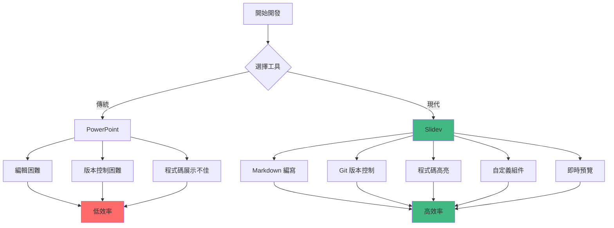

# Slidev 進階功能展示
## 自定義組件與互動式演示

探索 Slidev 的強大功能

<div class="pt-12">
  <span @click="$slidev.nav.next" class="px-2 py-1 rounded cursor-pointer" hover="bg-white bg-opacity-10">
    開始探索 <carbon:arrow-right class="inline"/>
  </span>
</div>

<div class="abs-br m-6 flex gap-2">
  <button @click="$slidev.nav.openInEditor()" title="在編輯器中打開" class="text-xl slidev-icon-btn opacity-50 !border-none !hover:text-white">
    <carbon:edit />
  </button>
  <a href="https://github.com/slidevjs/slidev" target="_blank" alt="GitHub"
    class="text-xl slidev-icon-btn opacity-50 !border-none !hover:text-white">
    <carbon-logo-github />
  </a>
</div>

---
layout: default
---

# 目錄

<Toc maxDepth="1"></Toc>

---
transition: fade-out
---

# 自定義組件示範

Slidev 允許你創建和使用自定義 Vue 組件

<div grid="~ cols-2 gap-4">
<div>

## 互動式計數器

這是一個自定義的計數器組件：

<Counter :count="10" />

你可以點擊按鈕來增加或減少數值。

</div>
<div>

## 組件程式碼

```vue {all|1-7|9-25|27-47}
<script setup lang="ts">
import { ref } from 'vue'

const props = defineProps<{
  count: number
}>()

const counter = ref(props.count)
</script>

<template>
  <div flex="~" w="min" border="~ gray-400 rounded-md">
    <button
      border="r gray-400"
      p="2"
      font="mono"
      outline="!none"
      hover:bg="gray-400 opacity-10"
      @click="counter -= 1"
    >
      -
    </button>
    <span font="mono" p="2" w="50px" text="center">{{ counter }}</span>
    <button
      border="l gray-400"
      p="2"
      font="mono"
      outline="!none"
      hover:bg="gray-400 opacity-10"
      @click="counter += 1"
    >
      +
    </button>
  </div>
</template>
```

</div>
</div>

---
layout: two-cols
---

# VueUse 整合

使用 VueUse 提供的 Composables 來增強功能

```vue
<script setup>
import { useToggle, useMouse } from '@vueuse/core'

const isDark = ref(false)
const toggleDark = useToggle(isDark)
const { x, y } = useMouse()
</script>
```

::right::

<Demo />

---

# 程式碼執行

Slidev 支援即時程式碼執行和編輯

```ts {monaco}
import { computed, ref } from 'vue'

// 響應式資料
const count = ref(0)
const doubled = computed(() => count.value * 2)

// 函數定義
function increment() {
  count.value++
}

function decrement() {
  count.value--
}

console.log('當前計數:', count.value)
console.log('雙倍計數:', doubled.value)

// 試試修改這些程式碼！
```

---

# 動畫與過渡

使用 v-motion 創建精美的動畫效果

<div class="w-full h-400px relative">
  <div
    v-motion
    :initial="{ x: -200, y: 0, scale: 0.5, opacity: 0 }"
    :enter="{ x: 0, y: 0, scale: 1, opacity: 1, transition: { duration: 1000 } }"
    class="absolute"
  >
    <div class="w-20 h-20 bg-blue-500 rounded-full flex items-center justify-center text-white font-bold">
      Vue
    </div>
  </div>

  <div
    v-motion
    :initial="{ x: 200, y: 100, scale: 0.5, opacity: 0 }"
    :enter="{ x: 100, y: 50, scale: 1, opacity: 1, transition: { duration: 1000, delay: 500 } }"
    class="absolute"
  >
    <div class="w-20 h-20 bg-green-500 rounded-full flex items-center justify-center text-white font-bold">
      Slidev
    </div>
  </div>

  <div
    v-motion
    :initial="{ x: 0, y: 200, scale: 0.5, opacity: 0 }"
    :enter="{ x: 200, y: 100, scale: 1, opacity: 1, transition: { duration: 1000, delay: 1000 } }"
    class="absolute"
  >
    <div class="w-20 h-20 bg-purple-500 rounded-full flex items-center justify-center text-white font-bold">
      Magic
    </div>
  </div>
</div>

---

# 複雜圖表

使用 Mermaid 創建複雜的流程圖



---

# 數學公式渲染

KaTeX 支援複雜的數學公式

## 線性代數

向量的點積：
$$\vec{a} \cdot \vec{b} = |\vec{a}||\vec{b}|\cos\theta$$

矩陣乘法：
$$\begin{pmatrix} a & b \\ c & d \end{pmatrix} \begin{pmatrix} e & f \\ g & h \end{pmatrix} = \begin{pmatrix} ae+bg & af+bh \\ ce+dg & cf+dh \end{pmatrix}$$

## 微積分

泰勒級數展開：
$$f(x) = \sum_{n=0}^{\infty} \frac{f^{(n)}(a)}{n!}(x-a)^n$$

## 統計學

正態分佈概率密度函數：
$$f(x) = \frac{1}{\sigma\sqrt{2\pi}} e^{-\frac{1}{2}\left(\frac{x-\mu}{\sigma}\right)^2}$$

---
layout: image-right
image: https://source.unsplash.com/1280x720/?code,computer
---

# 進階程式碼功能

## 多行高亮

```python {1,3-4|2,5|6-10}
def fibonacci(n):
    if n <= 1:
        return n
    else:
        return fibonacci(n-1) + fibonacci(n-2)

# 使用範例
for i in range(10):
    print(f"F({i}) = {fibonacci(i)}")
```

## 程式碼執行

```javascript {monaco-run} {autorun:false}
// JavaScript 範例 - 可執行！
function quickSort(arr) {
  if (arr.length <= 1) return arr;
  
  const pivot = arr[Math.floor(arr.length / 2)];
  const left = arr.filter(x => x < pivot);
  const middle = arr.filter(x => x === pivot);
  const right = arr.filter(x => x > pivot);
  
  return [...quickSort(left), ...middle, ...quickSort(right)];
}

const numbers = [64, 34, 25, 12, 22, 11, 90];
console.log('原始陣列:', numbers);
console.log('排序後:', quickSort(numbers));
```

---

# 響應式佈局

<div grid="~ cols-1 md:cols-3 gap-4">

<div class="card">
  <h3 v-click="1"><mdi:rocket-launch class="inline mr-2"/>快速開發</h3>
  <p v-click="2">使用熟悉的 Markdown 語法快速創建演示文稿</p>
</div>

<div class="card">
  <h3 v-click="3"><mdi:puzzle class="inline mr-2"/>可組合性</h3>
  <p v-click="4">組件可以重複使用，主題可以共享</p>
</div>

<div class="card">
  <h3 v-click="5"><mdi:code-tags class="inline mr-2"/>開發者友好</h3>
  <p v-click="6">版本控制、熱重載、TypeScript 支援</p>
</div>

</div>

<style>
.card {
  @apply p-4 rounded-lg border border-gray-200 bg-white shadow-sm;
}
.dark .card {
  @apply border-gray-700 bg-gray-800;
}
</style>

---
layout: center
class: text-center
---

# 更多功能等你探索

<div grid="~ cols-2 gap-8" class="mt-8">

<div>
  <h3 class="text-xl font-bold mb-4">🎯 專業功能</h3>
  <ul class="text-left space-y-2">
    <li v-click="1">• PDF/PNG 導出</li>
    <li v-click="2">• 演講者模式</li>
    <li v-click="3">• 錄製功能</li>
    <li v-click="4">• 遠端控制</li>
  </ul>
</div>

<div>
  <h3 class="text-xl font-bold mb-4">🛠 開發工具</h3>
  <ul class="text-left space-y-2">
    <li v-click="5">• VS Code 擴展</li>
    <li v-click="6">• TypeScript 支援</li>
    <li v-click="7">• 熱重載</li>
    <li v-click="8">• 自定義主題</li>
  </ul>
</div>

</div>

<div class="mt-12">
  <a href="https://sli.dev" target="_blank" class="btn">
    開始使用 Slidev
  </a>
</div>

<style>
.btn {
  @apply inline-block px-6 py-3 bg-blue-600 text-white rounded-lg hover:bg-blue-700 transition-colors;
}
</style>