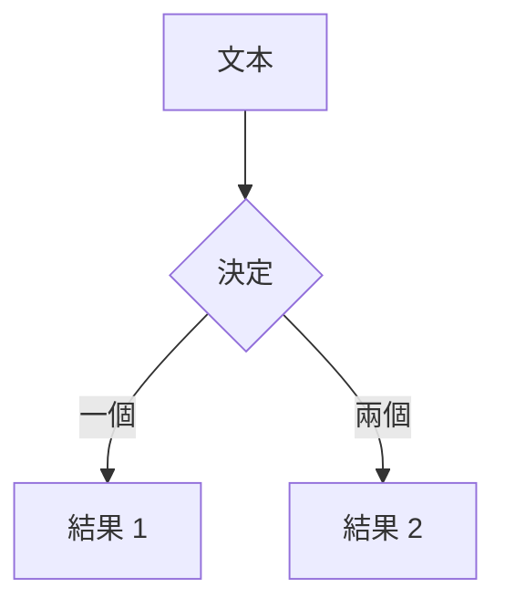

# Slidev 基本功能展示

歡迎來到 Slidev 的世界

<div class="pt-12">
  <span @click="$slidev.nav.next" class="px-2 py-1 rounded cursor-pointer" hover="bg-white bg-opacity-10">
    按空格鍵進入下一頁 <carbon:arrow-right class="inline"/>
  </span>
</div>

<div class="abs-br m-6 flex gap-2">
  <button @click="$slidev.nav.openInEditor()" title="在編輯器中打開" class="text-xl slidev-icon-btn opacity-50 !border-none !hover:text-white">
    <carbon:edit />
  </button>
  <a href="https://github.com/slidevjs/slidev" target="_blank" alt="GitHub" title="打開 GitHub"
    class="text-xl slidev-icon-btn opacity-50 !border-none !hover:text-white">
    <carbon-logo-github />
  </a>
</div>

---

# 什麼是 Slidev？

Slidev 是為開發者設計的演示文稿工具

- 📝 **文本為主** - 專注於內容，用 Markdown 編寫
- 🎨 **可主題化** - 主題可以共享和重複使用
- 🧑‍💻 **開發者友好** - 程式碼高亮、即時編輯
- 🤹 **互動式** - 嵌入 Vue 組件
- 🎥 **錄製** - 內建錄製和相機視圖
- 📤 **可攜式** - 導出為 PDF、PNG，或可部署的 SPA
- 🛠 **可駭客化** - 任何網頁上可能的事情都可以做到

<br>
<br>

閱讀更多關於 [為什麼選擇 Slidev？](https://sli.dev/guide/why)

---

# 導航

將滑鼠懸停在左下角以查看導航的控制面板，[了解更多](https://sli.dev/guide/navigation.html)

### 鍵盤快捷鍵

|     |     |
| --- | --- |
| <kbd>right</kbd> / <kbd>space</kbd>| 下一個動畫或投影片 |
| <kbd>left</kbd>  / <kbd>shift</kbd><kbd>space</kbd> | 前一個動畫或投影片 |
| <kbd>up</kbd> | 前一個投影片 |
| <kbd>down</kbd> | 下一個投影片 |

<!-- https://sli.dev/guide/navigation.html -->

---
layout: image-right
image: https://source.unsplash.com/1280x720/?programming
---

# 程式碼

使用程式碼片段並且即時獲得高亮顯示

```ts {all|2|1-6|9|all}
interface User {
  id: number
  firstName: string
  lastName: string
  role: string
}

function updateUser(id: number, update: User) {
  const user = getUser(id)
  const newUser = { ...user, ...update }  
  saveUser(id, newUser)
}
```

<arrow v-click="3" x1="400" y1="420" x2="230" y2="330" color="#564" width="3" arrowhead="arrowhead-classic" />

---

# 組件

<div grid="~ cols-2 gap-4">
<div>

你可以在你的投影片中使用 Vue 組件。

我們為你提供了一些內建的組件，如 `<Tweet/>` 和 `<Youtube/>`，你也可以添加你自己的組件。

```html
<Counter :count="10" />
```

<!-- ./components/Counter.vue -->
<Counter :count="10" m="t-4" />

檢查 [指南](https://sli.dev/builtin/components.html) 了解更多。

</div>
<div>

```html
<Tweet id="1390115482657726468" />
```

<Tweet id="1390115482657726468" scale="0.65" />

</div>
</div>

---
class: px-20
---

# 主題

Slidev 配有強大的主題支持。主題可以提供風格、配置、組件，甚至是整個配置。

<div grid="~ cols-2 gap-2" m="-t-2">

```yaml
---
theme: default
---
```

```yaml
---
theme: seriph
---
```


</div>

閱讀更多關於 [如何使用主題](https://sli.dev/themes/use.html) 和
查看 [驚人的主題畫廊](https://sli.dev/themes/gallery.html)。

---
preload: false
---

# 動畫

動畫由 [@vueuse/motion](https://motion.vueuse.org/) 提供支持。

```html
<div
  v-motion
  :initial="{ x: -80 }"
  :enter="{ x: 0 }">
  Slidev
</div>
```

<div class="w-60 relative mt-6">
  <div class="relative w-40 h-40">
    
    
    
  </div>

  <div 
    class="text-5xl absolute top-14 left-40 text-[#2B90B6] -z-1"
    v-motion
    :initial="{ x: -80, opacity: 0}"
    :enter="{ x: 0, opacity: 1, transition: { delay: 2000, duration: 1000 } }">
    Slidev
  </div>
</div>

<!-- vue script setup can be used in markdown, and will only affects current page -->
<script setup lang="ts">
const final = {
  x: 0,
  y: 0,
  rotate: 0,
  scale: 1,
  transition: {
    type: 'spring',
    damping: 10,
    stiffness: 20,
    mass: 2
  }
}
</script>

<div
  v-motion
  :initial="{ x:35, y: 40, opacity: 0}"
  :enter="{ y: 0, opacity: 1, transition: { delay: 3500 } }">

[了解更多](https://sli.dev/guide/animations.html#motion)

</div>

---

# LaTeX

LaTeX 是通過 [KaTeX](https://katex.org/) 開箱即支持的。

<br>

行內 $\sqrt{3x-1}+(1+x)^2$

塊級
$$
\begin{array}{c}

\nabla \times \vec{\mathbf{B}} -\, \frac1c\, \frac{\partial\vec{\mathbf{E}}}{\partial t} &
= \frac{4\pi}{c}\vec{\mathbf{j}}    \nabla \cdot \vec{\mathbf{E}} & = 4 \pi \rho \\

\nabla \times \vec{\mathbf{E}}\, +\, \frac1c\, \frac{\partial\vec{\mathbf{B}}}{\partial t} & = \vec{\mathbf{0}} \\

\nabla \cdot \vec{\mathbf{B}} & = 0

\end{array}
$$

<br>

[了解更多](https://sli.dev/guide/syntax#latex)

---

# 圖表

你可以從你的 Markdown 中創建圖表／圖形 - 只要將它們包圍在代碼塊中並指定語言為 `mermaid`：



[了解更多](https://sli.dev/guide/syntax#diagrams)

---
layout: center
class: text-center
---

# 了解更多

[文檔](https://sli.dev) · [GitHub](https://github.com/slidevjs/slidev) · [展示](https://sli.dev/showcases.html)